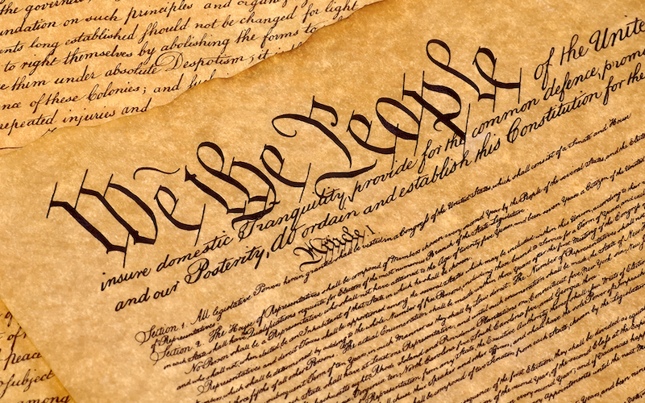

## Standards Are The Peoples Code

&nbsp;&nbsp;&nbsp;&nbsp; You may not realize this but we live in a world full of standards. It's just a matter of interpretation and how that person views it as a standard. Standard is defined as ":something established by authority, custom, or general consent as a model or example" according to Merriam-Webster dictionary. With that being said let's take a little trip down history. At the birth of the United States our founding fathers wanted to differentiate themselves from the United Kingdom when drafting the law of the land of our young nation. The birth of the Constitution was created as the standard of our young Nation and sets up a law that every citizens of the United States will always have freedoms in place that the government can not touch. Such freedoms consists of the usual suspects such as freedom of speech, freedom to own property, freedom to openly practice religion of the citizens choosing, and so forth which surely will differentiaite itself from The United Kingdom. As new nations developed around the world, the constitution became and/or is preceived as the standard of how their new country will be. For example, Mynamar who until 2011 was ruled by the military and finally adopted a democractic government which was loosly based on the United States Constitution. 

&nbsp;&nbsp;&nbsp;&nbsp; A standard will always be needed even if some people will not agree to it. Just like our government we all adopt a majority rules mentality and fair is fair. Having placed a standard in our day to day life keeps us from chaos and helps restraint our possible animalistic tendances. For exmple, having a standard such as our consitution differentiates of from the animal kingdom, even the holy bible is a form of code of conduct which is also a standard in a spiritual sense. We as people in some form acknowledge that our actions needs to be guided and restrained because it we can't govern ourselves or compose ourself properly we will be no different from the animals. For example, a seaturtle who once she lays her eggs will go back to the ocean and will never see her childeren or even recognize them once they give birth or like a shark who is not ashamed of eating its own kind. For us seeing things, like how a seaturtle will treat her youngs or seeing a shark eating its own kind as barbaric and cruel to them its just a matter of nature. Without the standards we place on our soceity we would not be where we are today. 

&nbsp;&nbsp;&nbsp;&nbsp; There are many other examples of how standards is our soceities unwritten code, be it a code of law, code of conduct, or a personal standard that you placed on yourself. For example, just with school you may have set a standard that you will not get any B's this semester. Again to reiterate what I mentioned above, there are many more examples of how standards is the unwritten code our our soceity which is only proper to also have a standard when coding. I maybe too young to remember this but when coding started to become mainstream many companies wanted to cash in on programming and with each company they set their own standards. However, they did not realize there was one to many cooks in the kitchen, and of course programmers would eventually perfer one company over the other and as time passes a standard started forming. I for one prefer to have a coding standard, reason being is that when I look at another persons code the structure of the code will be simililar to mines and I will not have to ask that person too many questions. Also when coding having standards in placed makes a programmers code look more crisp, clean, and organized. Knowing what I know that we live in a soceity of standards adding a coding standard is no problem for me, I live it everyday and having a coding standard is just another one to add to that list and will allow me to be a civilized human being. 

## Coding Done Right

&nbsp;&nbsp;&nbsp;&nbsp; I have been lucky enough to be exposed to many different programming languages, for example, c#, c, c++, java, javacript but my first real exposure to programming languages was c# and the one thing I wish my professor should have warned us his students that there are many many more different languages out there and that c# is but one in that many. Having and setting an expectation like that would have setup standards for my own personal standards, however, I left that class thinking that c# was the only programming language and that the IDE that we used was the only IDE there was. I guess what i'm trying to say is to do coding the right way, the expectations need to be set and an open mind needs to be set as well. After taking that class the next programming language I was exposed to was c/c++ and this is where I got my rude awakening that c# wasn't the only language out there. During the time I was taking the class I was so lost I had no idea what I was doing, sure there were some parts that I understood, but what really blew me away and I had a hard time grasping is that the way to compile, link, and execute a program was done a completely different way. I had no idea that there was no one button that will do all that let alone having to work in a terminal screen and use a completely different code editor. I was a walking Greek tradegy, nonetheless, I prevailed, granted I failed that class the first time around and really left a bad taste in my mouth regarding programming for the next two years but in the end it made me a much better programmer because I know that I can code even if the direction i'm given isn't all to clear. 

&nbsp;&nbsp;&nbsp;&nbsp; The next programming language I was exposed to was Java, with that class our professor had us working within JGrasp and i'm back to the one button IDE where where it will compile, link, and execute my program from me which was really nice but knowing what I know now was never really gonna be like that for the rest of my career, which to me was fine. I welcomed the challenge. However, after going through c#, c, and c++, the Java language to me wasn't as bad, I took the class for two semester and both times walked away with an A. After my two semesters of Java, I felt like I was finally ready to take on c and c++ again. With my new gained experience in Java and new gained experience with loops and classes, I truly felt I was in a better situation. Boy was I wrong, see when I first initially took my c/c++ programming language it was a class under the engineering umbrella and the professor had a completely different way of teaching the class. When I re-took the c/c++ programming language this time around it was under the ICS umbrella and with that being said, my expectations about the class was way of. At this point I started to give up I told myself maybe i'm not meant to be a programmer but after some convincing I tried again but this time I completely through out all the expectations I ever had with any programming languages and went in with an open mind and a willingness to learn and so far its working great for me. Each failure for me only strengthen my experience. 

&nbsp;&nbsp;&nbsp;&nbsp;test
 

