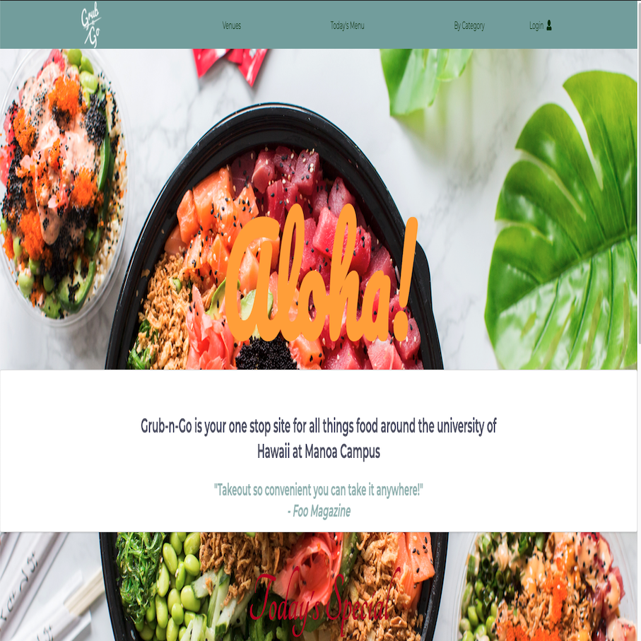

&nbsp;&nbsp;&nbsp;&nbsp;The purpose of this project is to demonstrate my ability to integrate all the materials learned from software engineering, such materials learned and applied are Configuration Management, UI design using HTML, CSS, Semantic UI, React, creating databases using MongoDB, Application Design by way of Meteor, Agile Project Management, Deployment via digitalOcean, Testing with testcafe, and Javascript. The objective of the project is to build a user-friendly website in which a student or faculty of the University Of Hawaii at Manoa is able to quickly look up all available food options on campus through one website.  
&nbsp;&nbsp;&nbsp;&nbsp;The first step in the project is figuring out what the problem is and coming up with a solution for that problem. For this project the problem is that there are currently too many food choices in and around the campus at manoa, in which there are many places to go to grab a bite to eat. However, what if the user wanted to eat a specific type of food, say, chinese, there isn't a site in where a user is able to specifically filter through all the available options that is currently being offered that day, or another example, if a user wanted to eat greek food but its only available certain days or time of the week again there is no place a student/faculty would be able to quickly goto to check. The solution is Grub-N-Go, within the website the user is able to find specific menu items that are available that very day from different vendors around the campus and the website will be able to show the user when a specific food type will be available and display the menu.
  
&nbsp;&nbsp;&nbsp;&nbsp;Once the problem is known and a solution is presented the following step was to creatively exchange ideas on how the website would be built and what tasks needed to be done. Our team created an organization on github and used project boards to help with the task organization. The team also agreed to meet on specific days to exchange ideas and express concerns. Github was extensively used for version control, so the other team could and would be able to work on the master code without harming the original copy. Below are sample images of the github organization and project boards that were used to help keep the team on track and help with version control.
  

      
      
  

   The final step in the design process was implementing and creating the code to effectively create the website. Majority of the coding for Grub-N-Go was done with GitHub desktop and IntelliJ Idea in tandem. Each time an issue would be done on the project board stated above the team member would notify the others of a merger. Once the issue has been merged with the master code the team member would then pick out a new issue and creat a new branch and would then work witing that branch and download that branch to the members computer using their localhost to be able to view the changes being done. This process is then repeated until all issues have been resolved.  
&nbsp;&nbsp;&nbsp;&nbsp; Some of the things I was tasked to do is to update the projects homepage with screen shots of the evolution of our website as time went on and edits are made. Another responsibility of mines initially was to create the components of the Navigation bar such as the venues, todays menu, top picks pages. Other contributions I did with the project initially was deploy the projects website using digitalOcean and purchasing a domain name and linking the domain name with digital ocean. As the project progressed so did the contributions of each team members, the second half of the project I feel was the hardest.  
&nbsp;&nbsp;&nbsp;&nbsp;The contribution I had contributed to the second half of the project was to implement a database collection using MongoDB, the database would consist of a collection of vendors and auto populate those vendors in the venues page. Along with creating a vendor collection, I was also tasked with creating a collection of vendor types. The form that a new vendor fills out consisted of a place for a vendor to be able to designate what types of food they serve, for example, if they served chinese, indian, greek, and so on and so forth and image of that form can be seen below. The purpose for the vendor type collection is for the possibility that the vendors establishment would appear in the filter page by category.  The image below shows the form that a new vendor would have to fill out in order for their establishment to be visible in the venues page and after successful sign-up the vendor establishment would then be added to the vendor collection and vendor type collection.
 
&nbsp;&nbsp;&nbsp;&nbsp;Towards the end of the project I gained new valuable skills in creating a database using MongoDB and was able to understand the purpose of the database. I was able to successfully learn how to purchase a domain name, create an online server using digital ocean, and lastly was able to visualize the process of creating a web site. The process starts with figuring out the problem, coming up with ideas to fix the problems. Once those are known the next step in the design methodology is staying organized and version control, which was successfully implemented by using github. Then the hardest part is implementing and creating the source codes needed to successfully launch the website. The project was broken down into several tiers which helped our team stay on top of the tasks at hand. Lastly, we were able to work in a collaborative environment with varying degrees of personalities. If you would like more information about this project and its successful execution you can visit our website at[Grub-N-Go](https://grubngo.xyz/) and if you would like to view our teams organization please visit our github organization at [Grub-N-Go Organization](https://github.com/grub-n-go/grub-n-go)

  
