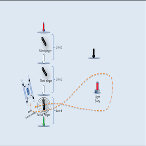
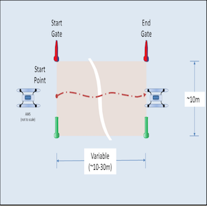
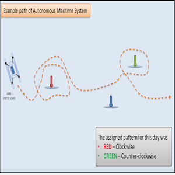
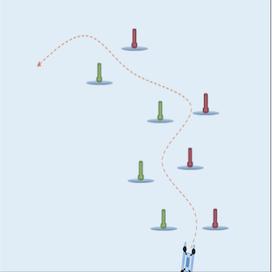

Team Kanaloa is a team of student engineers from different disciplines(i.e. mechanical, electrical, civil, computer) and also ICS students in the Department of Computer Science and Informattion Technology. The team is spearheaded by Professor A Zachary Trimble who is an Associate Professor in Mechanical Engineering at the University of Hawaii at Manoa and has a student engineer lead that substitues for Professor Trimble in the event he is not available.

The main objective of Team Kanaloa is Maintain, upkeep, and update the teams unmanned marine vessel(pictured to the right). With maintaining the boat the team would replace parts as needed, such parts could include rivets that may have rusted over during sea trials or equipments that is no longer operational. In terms of upkeep, the team would occasionally run simulations on the unmanned vessal to see if all components are still in working order and in some instances the team would do a field test to see if the machine is still sea worthy. As funding becomes available or research has been done and has been found there is a more efficient way to complete the teams ultimate goal, the team would then update the vessal.
  

The Ultimate goal of Team Kanaloa is to comepete in the Robot X Challenge and Win. Winning the challenge would give the team the funding to further enchance the vessal and bring a vertain prestige to the school for winning the challenge. If you would like to know more about the Robot X Challenge you can find their website [here](https://robotx.org). The Robot X challenge is an international, university- level competition in which students from around the world will test their unmanned vessal capabilities. For example, the vessal would need to be able to navigate around on its own using GPS navigation, the vessal would then need to do a series of task as in weaving and navigating through buoys, sample challenge images can be seen below.

  
  
  
  

Being breifly apart of Team Kanaloa, I was teamed up with a fellow student engineer in the electrical engineering department. Our task was to update the circuit diagram of the vessel and upload the diagram to a github repository. Each week the whole team would get together to talk about current status on our tasks and any new issues that may have risen during the previous week. Apart from the task of updating the circuit diagram, I was also tasked in creating a How-To-Guide for updating the circuit diagram on pSpice to help future students make any future updates on the circuit of the vessal. The How-To-Guide consisted of how to install the program on the students personal computer and how to get the proper licensing to use the program. The How-to-Guide also give a brief tutorial on how to get around and use the program itself. The last task I was assigned to is management of the vessals powerful batteries and making sure that they are charged properly and are turned on by team members who are properly trained.

Some of the take aways from working with Team Kanaloa, I learned to further my skills in circuit diagram and how to build one. Also learning from Team Kanaloa I was able to efficiently work well with a new program called pSpice, which is a software that virtually analysis circuits with real world applications such as voltages and currents and so forth.

If you would like to learn more about Team Kanaloa, you can find their site [here](http://rip.eng.hawaii.edu/research/unmanned-x-systems/) and if your a current University of Hawaii student in any of the Engineering fields or an ICS student looking for a fun and worthwhile project to get into during your time at school, you can inquire with the team [here](http://rip.eng.hawaii.edu/contact-us/).

