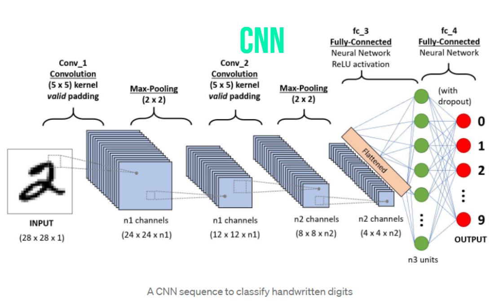

  

&nbsp;&nbsp;&nbsp;&nbsp;The objective of this project is to build a machine learning algorithm that utilizes convolutional neural network deep learning to recognize digits 0 through 9. This project is the first step in AI assistance development as it could be used in going through large amounts of digital documents and transcribing difficult and tedious handwritting with high accuracy and speed. The machine learning algorithm would not be limited to one language and could potentially be used in real time while streaming video to transcribe and translate difficult and foreign characters. With a machine learning algorithm that is used in assistance, it could make recording important documentation a lot more efficient and affordable as well as connecting people all accross the globe, all with just 1 digit at a time.

&nbsp;&nbsp;&nbsp;&nbsp;The group project consisted of 2 students and was split into two parts. One student focused on research, development, and presentation of the project as their primary goal was to figure out which UI and programming language would best suit the project. After some testing and research they had concluded on using Tensorflow, however switched to google collab to have faster training speeds even though Tensorflow was the optimal interface. The other worked on the coding part of the project, such as training and improving test accuracy. Our primary goal was to have a consistant training step and not have the machine learning algorithm memorize the numbers instead of learning them. By working together they were able to reasearch and utilize binary cross entropy that penalizes probabilities based on expected values. After each image is analyzed the algorithm would categorize them by number 0 through 9 with the highest probability being the most likely number.

&nbsp;&nbsp;&nbsp;&nbsp;I was part of the coding team and my task involved researching current types of algorithms that may improve testing accuracies and building from the ground up with corresponding kernals. Some types of machine learning algorithms built and analyzed involved convolutional neural netowkrs (CNN), linear support vector machines (Linear SVM), and non-linear support vector machines (non-linear SVM). Every other day over the course of two weeks we would meet online to discuss current progress and work towards optimizing our parameters to improve accuracy further. I was able to get three working algorithms with all accuracies above 90% and successfully completed my tasks. The Future plans for this project is to enchance the algorithm and teach the algorithm to identify new characters such as the alphabet.

&nbsp;&nbsp;&nbsp;&nbsp;Working on the coding part of this Machine Learning project really helped me grow and expand my knowledge on what exactly machine learning can do. I was able to pick up learning to code in Tensorflow and Python very quickly and with the help of kernals I could accomplish my goals much faster than I expected. I also learned how to optimize my machine learning algorithms and adjust their hyper parameters to boost the accuracy of the models.

