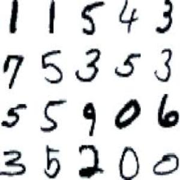
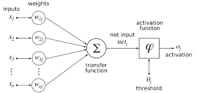

  
  

&nbsp;&nbsp;&nbsp;&nbsp;The objective of this project is to build a system in where cameras would be placed on rooftops all over Oahu and ultimately around the world to help maintain and make renewable energy much more effiecient. For example, if the leeward side of the island of Oahu and the windward side is cloudy and rainy the system would then divert all renewable energy collected on the leeward side to the windward side and vice-versa. With a system like this in place Oahu and potentially the world could potentially make full use of the renewable energy created and gathered from houses and business rather it going to waste and just decaying.

&nbsp;&nbsp;&nbsp;&nbsp;The group project consisted of 6 students and was split into two teams of 3. One team was called the Spresense team, their primary goal was to have the camera and SD card talk to the arudino software. The other team was called the machine learning team, the machine learning teams' primary goal is to build an algorithm that would take in pictures as input from the Spresense team and and arduino program and the algorithm would then run the image through the algorithm to a initially pre-defined database on what would consitute on an image being cloudy or an image being not cloudy. After each image is analyzed the alogirthm would then add that knowledge from the image to its database. 

&nbsp;&nbsp;&nbsp;&nbsp;I was part of the machine learning team and my task involved researching current algorithms that might help with our algorithms design and building an algorithm from scratch and running a simulation of the algorithm. Every week the team would meet via zoom and discuss our current achievements and failures. The machine learning team was able to complete their task and have a working algorithm. Future plans for the project is to enchance the algorithm and teach the algorithm to acept new images from the Spresense team.

&nbsp;&nbsp;&nbsp;&nbsp;Being on the Machine Learning team definetly helped me understand more about algorithms and machine learning in how machine learning is treated as a neural network just like a neural network of people. I also learned to code in yet another programming languages such as Sony Neural Network and Arduino. I also learned how to link two completly different programs to work cohesively with one another. 

If you would like to learn more of even join our team our website can be found [here](http://manoa.hawaii.edu/me/redlab/).

