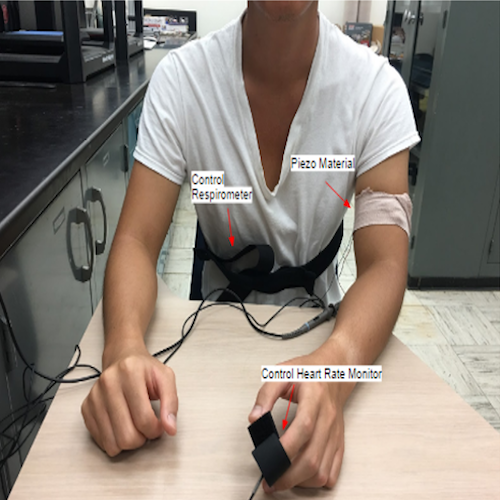
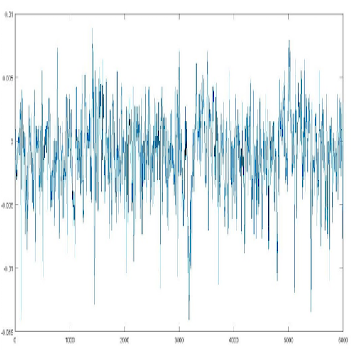
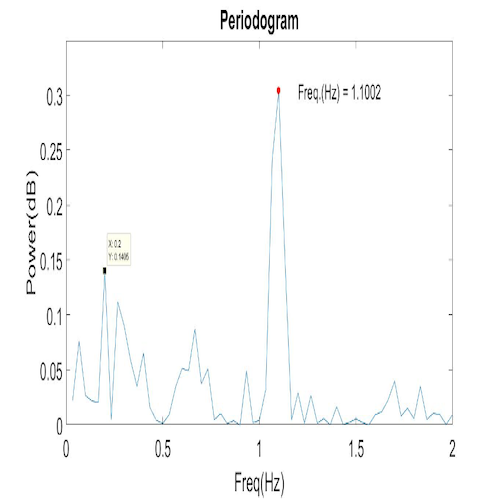

The objective of the of the Biometric Piezoelectric Sensor team was to design a non-invasive way to properly measure a persons repiratory rate, heart rate, and blood pressure by way of piezoelectricity. First discovered by brothers Pierre and Pau Jacques Curie. The way piezoelectricity works is electricity is created by adding pressure in a crystaline substance. A picture of the material used for this project can be found below. The disign of the device needed to be a user-friendly device that in emergency situations or everyday use any user would be able to properly measure their vital signs, be it a first responder or consumer.

  
  
  
  

The image above starting from the left(Image of a piezo electric capable material). Second image to the right of the first image is a patient with piezo electric material wrapped around their right arm, wrapped in bandages. Third image to the right from the first image on the left is a graph that shows the patients heart rate. Last image on the right is the patients heart rate after eliminating the noise from the previous image using matlab.

The device to be created would use the energy emitted from the user by means of respiratory motion. Since the device will be powered by the human body the device could be used when no available power source is nearby. Such place may include times of a black out, local and global catastrophies, and remote locations. With such potential uses in extreme conditions the device also needed to be able to be water, dust, and drop resistant.

For this project, it was a team of 4 people. The team was then broken down further in groups of two. Group 1 would be responsible for doing the research in terms of mathimatical calculations and research into current research being done on piezo electricity around the world. Group 2 was responsible for experimentation and taking notes of any successes or issues that arises. Some experiments consisted of how the device would measure vital signs in different forms of action from the patient, for example, sitting, standing, walking, running. Each morning the two groups would talk about the previous days result and current days goal. Every morning the group would then teach each other of update each other about what they have found and give a status update. The begining of every week the two groups would then swap roles so that each group is aware and gains experience in the different aspects of the project. 

Working with the Biometric Piezoelectric Sensor team introduced me to my first collaborative environment. Working with a team and meeting weekly to talk about the situation of the project. Working with the Biometric Piezoelectric Sensor team also first introduced me to working with matlab and how to code and manipulate and graph values attained from an external device.

If you would like to view our teams final presentation you can view it [here](https://github.com/ryanv048/ryanv048.github.io/blob/master/Final%20Presentation%202019-10-09%2019_34_06.pdf).

