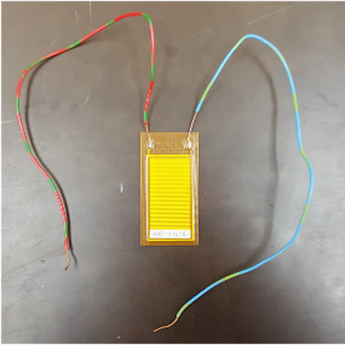

<div class="ui small rounded images">
  
  
  
  
</div>

The objective of the of the Biometric Piezoelectric Sensor team was to design a non-invasive way to properly measure a persons repiratory rate, heart rate, and blood pressure by way of piezoelectricity. First discovered by brothers Pierre and Pau Jacques Curie. The way piezoelectricity works is electricity is created by adding pressure in a crystaline substance. A picture of the material used for this project can be found below. The disign of the device needed to be a user-friendly device that in emergency situations or everyday use any user would be able to properly measure their vital signs, be it a first responder or consumer.

<div class="ui small rounded images">
  
  
  
  
</div>

The device to be created would use the energy emitted from the user by means of respiratory motion. Since the device will be powered by the human body the device could be used when no available power source is nearby. Such place may include times of a black out, local and global catastrophies, and remote locations. With such potential uses in extreme conditions the device also needed to be able to be water, dust, and drop resistant.

Some of the current technology consists of an Electrocardiogram(EKG or ECG) which record and displays an individuals heart rate, this type of feature can now be found in most smart watches such as the apple watch. Another technology that could be replace with this project would me the common thermometer and a sphygnomanometer, a sphygnomameter is a device that measures an individuals blood pressure. Some of the limitations of these devices is that it continues to need a constant source of power, such as batteries and ac power, which in case of a black out or a remote location the power to the current devices can not maintain energy after a certain amount of time. Some other limitations include portability, convenience, and most importantly accessibility.

For this project, I was the lead programmer who was responsible for programming the various capabilities of the mouse.  I started by programming the basics, such as sensor polling and motor actuation using interrupts.  From there, I then programmed the basic PD controls for the motors of the mouse.  The PD control the drive so that the mouse would stay centered while traversing the maze and keep the mouse driving straight.  I also programmed basic algorithms used to solve the maze such as a right wall hugger and a left wall hugger algorithm.  From there I worked on a flood-fill algorithm to help the mouse track where it is in the maze, and to map the route it takes.  We finished with the fastest mouse who finished the maze within our college.

Here is some code that illustrates how we read values from the line sensors:

```js
byte ADCRead(byte ch)
{
    word value;
    ADC1SC1 = ch;
    while (ADC1SC1_COCO != 1)
    {   // wait until ADC conversion is completed   
    }
    return ADC1RL;  // lower 8-bit value out of 10-bit data from the ADC
}
```

You can learn more at the [UH Micromouse Website](http://www-ee.eng.hawaii.edu/~mmouse/about.html).


