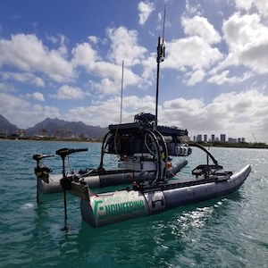

Vacay is a web application that I helped create as a team project in ICS 415, Spring 2015. The project helped me learn how to design and implement a responsive web site.

Vacay is implemented using [Meteor](http://meteor.com), a JavaScript application platform. Within two weeks, we created a website that implements several types of reservations including flights, hotels, and car rentals.

In this project I gained experience with full-stack web application design and associated technologies, including [MongoDB](http://mongodb.com) for database storage, the [Twitter Bootstrap](http://getbootstrap.com/) CSS Framework for the user interface, and Javascript for both client and server-side programming. 

If you would like to learn more about Team Kanaloa, you can find their site [here](http://rip.eng.hawaii.edu/research/unmanned-x-systems/) and if your a current University of Hawaii student in any of the Engineering fields or an ICS student looking for a fun and worthwhile project to get into during your time at school, you can inquire with the team [here](http://rip.eng.hawaii.edu/contact-us/).

