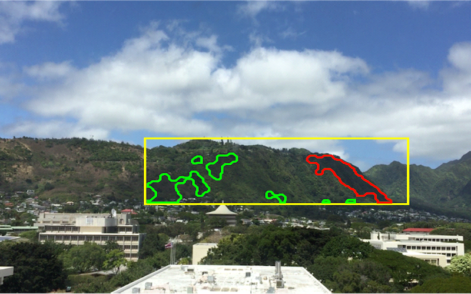
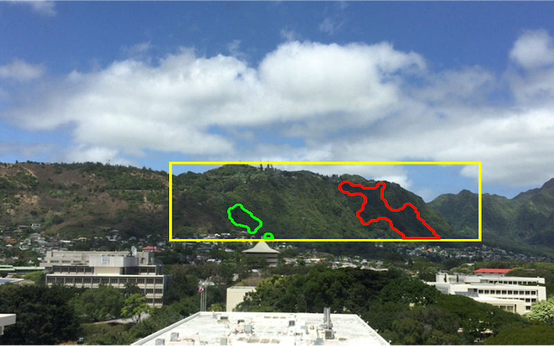

  
  

&nbsp;&nbsp;&nbsp;&nbsp;The objective of this project is to build a machine learning algorithm that works along side OpenMV to create computer vision to successfully detect Coconut Rhinoceros Beetles. Convolutional neural networks (CNN), a deep learning algorithm best used for image classification, was used detect and identify multiple native hawaiian insects and the non-native coconut rhinoceros beetles. This project is the first step in helping the environment and coconut trees across hawaii as it could be further improved for other islands and countries. With the assistance of monitoring multiple traps, it could provide invaluable data and information by tracking entire colonies in real time. With machine learning, we could makes protecting the environment much easier and affordable for everyone!

&nbsp;&nbsp;&nbsp;&nbsp;The project consisted of two groups, the arduino coding team, and the machine learning team. The arduino team focused on researching what hardware to use, importing modules, connecting to wifi/LTE, connecting and recieving data from url, managing device power, device sleep time, and more. OpenMV was decided on as the optimal choice as it supports machine learning libraries, is compact and small enough to fit into traps, supports a wifi shield, and is low power (less than 200mA) so that it can be powered by solar energy. As for the machine learning team, Tensorflow was utilized as it is a free open source library for machine learning. Tensorflow was the optimal choice becase it can be coded in python which has a lot of resources and code to learn from and it can be easily exported to embedded systems like OpenMV. The machine learning team created a convolutional neural network to identify coconut rhinoceros beetles and with the help of transfer learning, utilized the pre-trained MobileNet model. By using transfer learning the machine learning team could obtain a higher accuracy, a faster training time, and was overall less computationally intensive. The machine learning team trained on cats and dogs initially, but switched to coconut rhinoceros beetles and hawaiian insects once they were able to obtain more images. After obtaining the desired accuracy, the machine learning team used quantization to load it onto the mobile device.

&nbsp;&nbsp;&nbsp;&nbsp;I was part of the machine learning team and my task involved assisting with coding, training, and obtaining images that could be used for training to improve accuracies. I had picked up some work that was necessary for both teams to properly communicate with each other such as writing the code to bus the information over from the device to a local url through wifi/LTE. After sending the information over, it was important to write code to listen for POSTS on the url and to properly identify and classify them into a database to be viewed and I had accomplished this with PHP code and MySQL. I was able to successfully help get the algorithm to reach an accuracy above 90% and send all data such as images, messages, time, date, and trap location to our online server.

&nbsp;&nbsp;&nbsp;&nbsp;Working on both teams of this Machine Learning project helped me expand my skills on developing computer vision applications and implementing them for real time use. I was able to grow my skills with Tensorflow, Python, and learned some PHP code along the way. Not everything was straight forward, but working on the project consistantly allowed us to create pathways for the team to continue with the project to its completion. Helping create new ideas to solve difficult problems was my favorite part of this project and I hope to continue working with teams to create new and exciting inovative ideas.

If you would like to view our project's final paper you can view it [here](https://github.com/kylejneubauer18/kylejneubauer18.github.io/blob/3ed7f1e8230b498fb588c0841f180d1808437675/496%20Paper.pdf).

If you would like to view our project's powerpoint you can view it [here](https://github.com/kylejneubauer18/kylejneubauer18.github.io/blob/d849ef655c2cb17fcf5418c169c2895182659675/496%20Poster%20Session.pdf)

