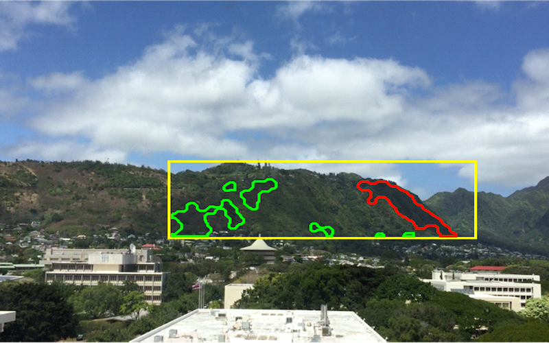

  
  

The objective of this project is to build a system in where cameras would be placed on rooftops all over Oahu and ultimately around the world to help maintain and make renewable energy much more effiecient. For example, if the leeward side of the island of Oahu and the windward side is cloudy and rainy the system would then divert all renewable energy collected on the leeward side to the windward side and vice-versa. With a system like this in place Oahu and potentially the world could potentially make full use of the renewable energy created and gathered from houses and business rather it going to waste and just decaying.

The way the system would work is there will be a camera that would consistently and periodically take picture of the sky once the picture has been taken it would then be saved on to a SD card and an LTE connectivity would then send that image to a remote arduino program ran on a rasberry pi system. The camera, LTE antenna, SD card slot, and the rasberry pi board would all be built together in a container that would than be placed on certain roof top locations. 
an algorithm using the Sony Neural Network Console that then pull

<pre>
You open your eyes, and you are greeted by an unfamiliar ceiling.
Startled, you get to your feet and quickly scan your surroundings. It's
dark except for the stream of light coming from a crack on the only boarded
window in the room. You try to peek through the crack, but you cannot see
anything. You wonder where you are and who could have possibly brought you here.

<--------------------help------------------------>
Enter quit or one of the following commands -
Weld light look walk pickup inventory help h ?
<------------------------------------------------>

look
The room is a picture of decay with only a faded number identifying it as room-4. The bed you were
 lying on is stained with what looks like dried blood. Could it be your blood? No - it is not. The
 only way out of the room aside from the door to the corridor is a window that is boarded shut. It
 looks like it has been like that for decades. There is a door going west from here. You see a candle
 on the floor. You see a match on the floor.

pickup candle
- you are now carrying the candle -

pickup match
- you are now carrying the match -

light match candle

The candle is now lit. It illuminates everything in the room.

walk west
The corridor is lit with the candle. It is so long that you cannot see to the end. You notice that
 there are words written on the wall. There is a door going east from here. There is a way going north
 from here. There is a door going south from here.
</pre>

Source: <a href="https://github.com/jogarces/ics-313-text-game"><i class="large github icon "></i>jogarces/ics-313-text-game</a>

